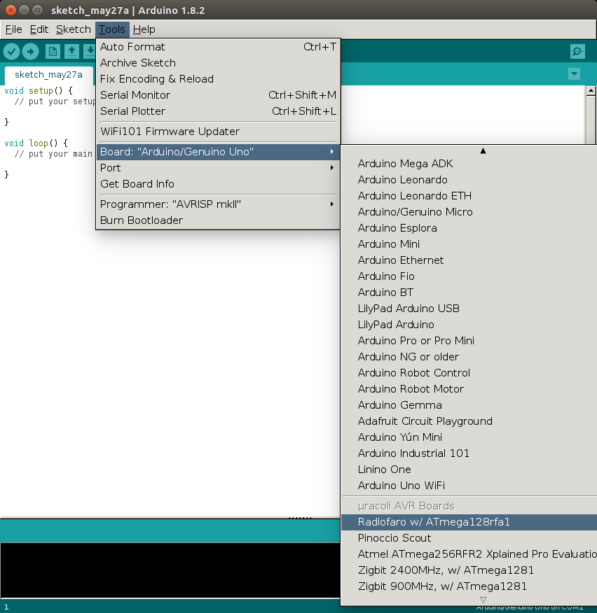

.. _µracoli: http://uracoli.nongnu.org
.. _Arduino-IDE: http://www.arduino.cc

Introduction
------------

The µracoli_ project provides a support package for
the Arduino-IDE_ .

The µracoli-Arduino-Support-Package (UASP) includes the HardwareRadio-Library,
which makes the usage of the radio transceiver as easy as the `Serial` module.

UASP requires an Arduino-IDE_ with a versions above > 1.5.x.

The following boards are supported in the package:

- radiofaro - Radiofaro w/ ATmega128rfa1
- pinoccio - Pinoccio Scout
- atzb256rfr2xpro - Atmel ATmega256RFR2 Xplained Pro Evaluation Kit
- wdba1281 - Zigbit 2400MHz, w/ ATmega1281
- mnb900 - Zigbit 900MHz, w/ ATmega1281

Installation
------------

Add the Board Manager URL for the UASP
**************************************

* From the Main Menu select *File / Preferences*
* In *Additional Boards Manager URLS* enter
  http://radiofaro.de/package_uracoli_index.json

Install the Package
*******************

* From the Main Menu select *Tools / Board / Boards Manager*
* type "uracoli" in the search field
  and press *Install* to select the latest package version.
* Press close to exit the *Boards Manager*

.. image:: select_boards_mgr.png
   :width: 90%
   :align: center

Select the Radio Transceiver Board
***********************************

* From the  *Tools /Board* menu select one of the supported radio transceiver boards.

Example Sketches
----------------

Wireless UART
**************

This example shows, how with a few lines of code, data from the serial
interface of one board can be transfered wirelessly to a remote board.

.. literalinclude:: ../../../Contrib/Arduino/examples/Radio/RadioUart/RadioUart.ino
   :linenos:
   :language: cpp
   :lines: 1-

Radio LED
*********

.. literalinclude:: ../../../Contrib/Arduino/examples/Radio/LedChat/LedChat.ino
   :linenos:
   :language: cpp
   :lines: 29-

References
----------

Radiofaro Pin Mappings
**********************

.. image:: radiofaro_r2.*
   :align: center

Function Reference
******************

.. doxygenclass:: HardwareRadio
    :members:

Bootloader Installation
-----------------------

In the case that sketches can not be uploaded, one reason maybe, that there is
no a working Bootloader on the board. So before flashing the bootloader, check
your setup, e.g. serial port and board type are selected correctly
and probably remove all external components.

Installation via Arduino IDE
****************************

The Bootloader can be flashed over the Arduino-IDE.

* connect an external programmer (AVRISP, UBStinyISP, ...) to the board.
* from the Main Menu select in *Tools / Programmer:* the programmer device
  you have connected.
* now select *Tools / Burn Bootloader*, ignore the avrdude-warnings and
  after a while the board has a new bootloader.
* to verify that the new bootloader is working, upload a sketch to the board
* disconnect the external programmer.

.. image:: burn_bootloader.png
   :align: center
   :width: 80%

Installation with arvdude
*************************

The Bootloader can be found in the package install path, e.g. under Linux
it might look so `~/.arduino15/packages/uracoli`.

You can find the local Arduino installation directory via *File / Preferences*, in the
dialogue window, check out the location of the config file

The bootloader can then flashed with this commands.
::
    cd ~/.arduino15/packages/uracoli/hardware/avr/0.6.0-20170509/bootloaders/radiofaro
    avrdude -P usb -c jtag2 -p m128rfa1 -U ATmegaBOOT_radiofaro.hex
    avrdude -P usb -c jtag2 -p m128rfa1 \
          -U lf:w:0xe2:m -U hf:w:0x1a:m -U ef:w:0xfe:m

What is Arduino?
----------------

Overview
********

A few words about Arduino. Who knows what Arduino is, may skip this section.

Arduino is a Microcontroller development plattform that consists of a Java-IDE
which supports various microcontroller boards. Most of the supported boards are
equipped mit 8-bit-AVR microcontrollers.

Basically the Arduino-IDE provides a simple code editor and the firmware
(denoted as "sketches") can be compiled and flashed with a button click.
A serial terminal completes the IDE. This high level of abstration makes it
easy for none technicians and first-time users to start with embedded programming.

What is a Sketch?
*****************

A sketch basically implements two functions setup() and loop() that are called
from the main function of the core library.
The available API-functions are described at http://arduino.cc/en/Reference/HomePage.

Beside the standard functions to operate digital and analogue IO-pins,
Arduino_ also provides various libraries for different hardware peripherals and
shields.

Arduino.org vs. Arduino.cc
***************************

The Arduino project did fork in 2014, see
http://hackaday.com/2015/04/06/arduino-ide-forked/ for details. Since this time there are two versions of the IDE avaiable.

IDE from arduino.cc::
    https://www.arduino.cc/en/Main/Software

IDE from arduio.org::
    http://www.arduino.org/downloads

Meanwhile the projects has rejoined and reference to the same IDE.

An interesting reading about the Arduino-History can be found here:
http://arduinohistory.github.io/
